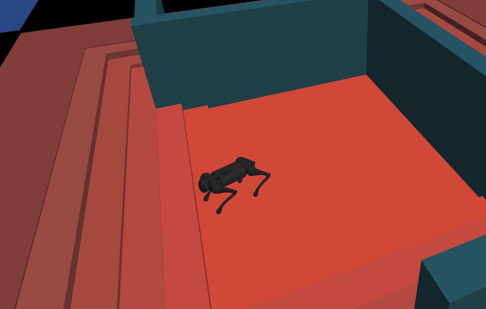
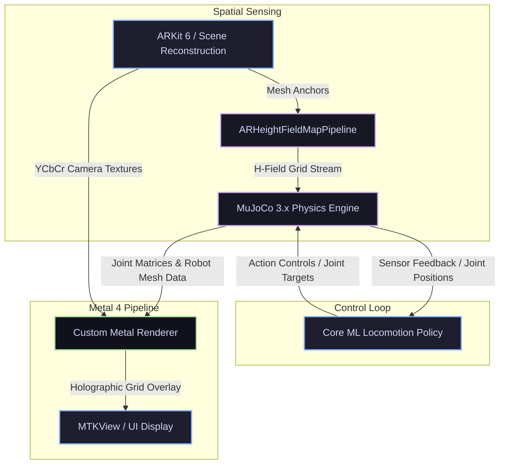

# 🤖 MujocoAR

<div align="center">

[](LICENSE)
[](https://developer.apple.com/ios/)
[](https://developer.apple.com/metal/)
[](https://mujoco.org/)
[](https://developer.apple.com/machine-learning/)

<p align="center">
  <b>An experimental iOS application running real-time MuJoCo locomotion policies inside a custom ARKit + Metal rendering pipeline.</b>
</p>

---



</div>

## 🌟 Overview

**MujocoAR** is a premium, cutting-edge iOS application designed to bridge the gap between advanced robotic physics simulation and physical environment ingestion. It executes high-fidelity locomotion policies for **Unitree Go1** (quadruped) and **Unitree G1** (humanoid) robots directly on Apple Silicon, overlaying real-world geometry reconstructed in real-time.

By converting ARKit scene reconstruction meshes into dynamic MuJoCo height-field collision terrains, the application allows simulated robots to physically traverse and interact with the user's actual room, powered by low-latency **Core ML** locomotion models.

---

## ✨ Core Features

- 🛰️ **AR Mode**: Real-time camera background rendering with dense scene reconstruction mesh ingestion, automatically mapping physical environments to MuJoCo collision terrain.
- 🎛️ **Procedural Debug Mode**: Virtual test bench featuring custom procedural terrain generation, orbit/TPS camera controls, live robot scaling, and dynamic tap-to-navigate pathing.
- 🧠 **On-Device Core ML Locomotion**: Ultra-low latency policy inference for the Unitree Go1 and G1 robots running directly on the Apple Neural Engine (ANE).
- ⚡ **Metal 4 Custom Renderer**: A high-performance renderer executing real-time shadow mapping, physical material shaders, and seamless holographic physics grid overlays.
- 📍 **Recast/Detour Navigation**: Full pathfinding integration through `RecastNavigationKit` for realistic obstacle avoidance and robot pathing.

---

## 🏗️ System Architecture & Pipeline

The pipeline showcases how spatial mesh anchors are captured, converted into collision boundaries, solved via physics, and composited into a highly optimized visual output:



---

## 🚀 Quick Start

### Prerequisites
* **macOS** with **Xcode** (iOS Deployment Target: `16.0` or higher).
* **Physical iOS Device** (iPhone/iPad with LiDAR is strongly recommended). The app will exit early on the simulator.
* **Apple Developer Signing Account** (for physical device deployment).

### Setup and Build

1. **Clone the Repository**
   ```sh
   git clone https://github.com/tatsuya-ogawa/MujocoAR.git
   cd MujocoAR
   ```

2. **Run the Project Bootstrap**
   This downloads the optional robot mesh repository ([mjlab](https://github.com/mujocolab/mjlab)) and automatically compiles the optimized 3D GLB assets for the iOS app bundle:
   ```sh
   ./scripts/bootstrap.sh --with-asset-sources
   ```

3. **Open the Project**
   ```sh
   open MujocoAR.xcodeproj
   ```

4. **Xcode Configuration**
   - Select the `MujocoAR` scheme.
   - Choose your physical iOS device as the run destination.
   - Navigate to **Signing & Capabilities** and assign your personal development team and a unique bundle identifier if necessary.

5. **Build & Run**
   Press `Cmd + R` to build and deploy to your device. Xcode resolves the remote Swift package dependencies (`mujoco-ios` and `RecastNavigationKit`) automatically.

> [!NOTE]
> `mujoco-ios` fetches its pre-compiled `mujoco.xcframework` binary target automatically, so local compilation of the C++ MuJoCo source is not required.

---

## 📂 Repository Layout

```text
├── MujocoAR/                 # Core iOS source code, Metal shaders, and UI Storyboards
│   ├── Resources/            # Bundled MuJoCo XML scenes, Core ML models, and render manifests
│   └── Base.lproj/           # App launch layouts
├── coreml/                   # TorchScript policy models and Core ML conversion utilities
├── docs/                     # Detailed architectural documents and assets
│   ├── images/               # README visual resources (Hero banner, etc.)
│   └── AR_SCENE_RECONSTRUCTION.md # AR height-field pipeline specifications
├── scripts/                  # Shell & Node.js automation scripts
│   ├── bootstrap.sh          # Environment & dependency integrity verification
│   └── prepare_ios_render_assets.mjs # 3D mesh optimizer and GLB asset bundler
├── LICENSE                   # Apache License 2.0
└── THIRD_PARTY_NOTICES.md    # Upstream credits, asset licensing, and dependencies
```

---

## 🛠️ Advanced Workflows

### 3D Asset Regeneration
If you make changes to raw robot model meshes or scenes in [mjlab](https://github.com/mujocolab/mjlab), you can regenerate and optimize the 3D GLB assets for the app:
```sh
# Using the local mjlab checkout cloned during bootstrap:
node scripts/prepare_ios_render_assets.mjs

# Or using an external mjlab path:
MJLAB_ROOT=/path/to/mjlab node scripts/prepare_ios_render_assets.mjs
```

### Core ML Conversion
To convert custom PyTorch/TorchScript policies into optimized Core ML models (`.mlpackage`):
```sh
python3 -m venv .venv
source .venv/bin/activate
pip install torch coremltools numpy
python coreml/convert_pt_to_coreml.py
```

---

## 📄 License & Credits

- This project is open-source under the [Apache License 2.0](LICENSE).
- Bundled robot meshes and XML configurations are sourced from [Unitree](https://github.com/unitreerobotics) and managed/packaged via [mjlab](https://github.com/mujocolab/mjlab).
- Core physics computation is powered by [MuJoCo](https://mujoco.org/) (Apache 2.0).
- Detailed dependency licensing and redistribution rights are tracked in [THIRD_PARTY_NOTICES.md](THIRD_PARTY_NOTICES.md).
